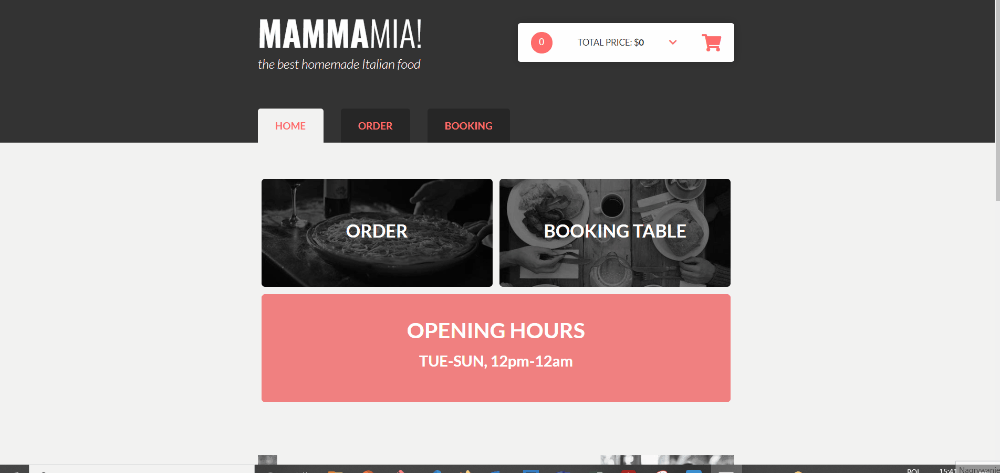

# PIZZERIA WEBSITE

PIZZERIA WEBSITE is aplication to simulate restarant website working - selecting order and booking table.

## How it works

## Link
https://gentle-ridge-92329.herokuapp.com/#/home

## Getting Started
1. git clone git@github.com:Webster2020/PIZZERIA_WEBSITE.git
2. npm run install
3. npm run watch - run the project and than You can see it on Your device

*...or use link if You only want to check how it works

## Used technologies:
 1. Vanilla JS
 2. SCSS for styling
 3. HTML5 for content
 4. Handlebars to HTML templates
 5. JSON Server to simulating the operation of the server
 6. Eslint to control bugs
 7. Flickity for slider
 8. Range-slider

## Implemented solutions:

  ** STRUCTURE: **
  - application divided into three subpages: home, order and booking
  - code responsible for routing creating in app.js
  - js code divided into classes and objects, placed in separeted files
  - every order and booking is sending on server (json server) - if You clone this repo, server is on http://localhost:3131/
  ** HOME: **
  - basic information about page
  - slider created with Flickity
  ** ORDER: **
  - cart on the top with selected products and form to making order
  - accordions with products
  - in every product user can select amount of product, ingredients, additives and add thems to cart
  ** BOOKING: **
  - form to select data
  - bar (with range-slider) to select time of booking
  - clickable picture to select free table
  - widgets to select amount of people and hours
  - form to select additives

## Project architecture

 1. content in index.html file
 2. templates with Handlebars
 3. styles in scss files - general file with import styles from partials
 4. JS files divided into:
  - app.js - main file
  - settings.js - select, templates, class and DOM elemenst objects
  - ustils.js - other functions
  - components catalog with js (e.g. Cart, Booking, Product ...) files
 5. server simulation:
  - server.js - simple server
  - db / app.json - data base with all registred users
 6. images catalog with svg and jpg files
 7. vendor catalog with range-slider files
 8. configuration files: gitignore, package.json, stylelintrc etc.

## How did I create this project?

Project was developed during the course - step by step.

## Plan for future development

 - notification when user make order or booking table 
 - forms full validation

## Authors

* **Michal Szwajgier** - *Webster2020* - 

## License
Free licence